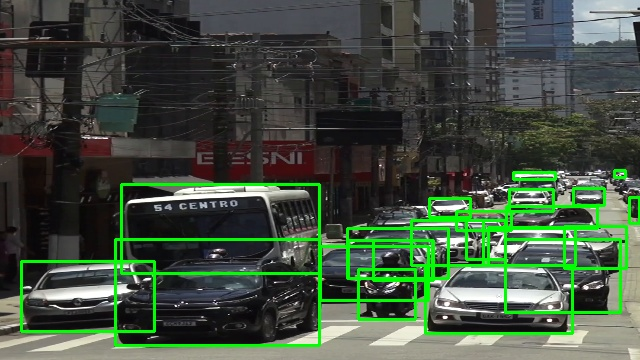
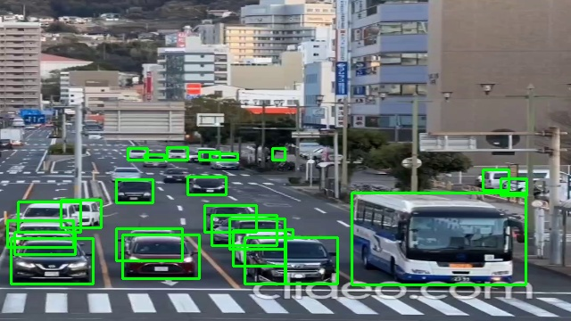
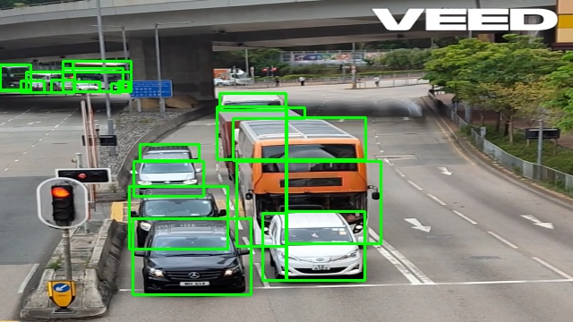
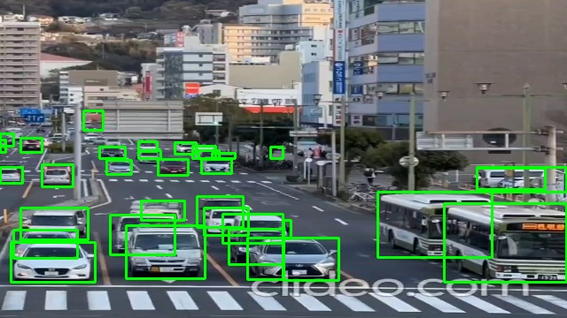
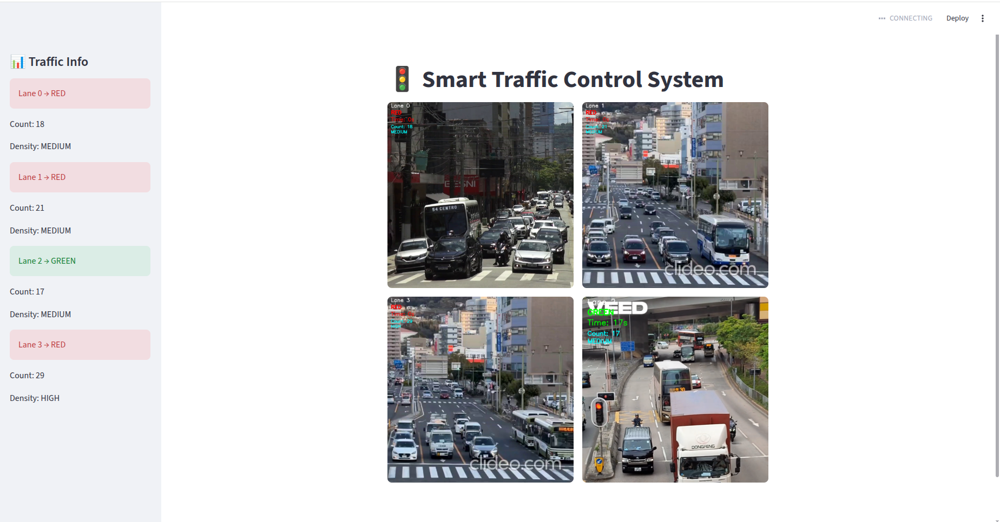
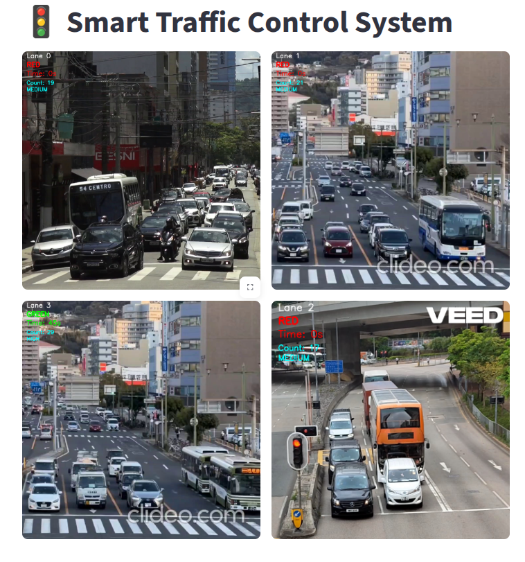

# 🚦 Smart Traffic Signal Management System

---

## 📌 Features

* 🎥 Multi-lane video processing (4 lanes simultaneously)
* 🚗 Vehicle detection using YOLOv8
* 📊 Dynamic traffic density calculation
* ⏱️ Adaptive signal timing (based on vehicle count)
* 🔄 Intelligent lane switching (round-robin)
* 🟢 Smooth video playback on GREEN signal (~25–30 FPS)
* 🔴 Frame freeze on RED signal (at 00:00)
* 🟡 Transition phase handling (YELLOW signal)
* ⚡ Multi-threaded video processing for performance
* 🖥️ Interactive UI using Streamlit

---

## 🛠️ Tech Stack

* **Frontend/UI:** Streamlit
* **Computer Vision:** OpenCV
* **AI Model:** Ultralytics YOLOv8 (`yolov8x.pt`)
* **Concurrency:** Python Threading
* **Language:** Python 3.10+

---

## ⏱️ Signal Timing Logic (decision.py)

### Dynamic Time Formula

```
Green Time = count × SEC_PER_CAR (1.6)
```

### Constraints

```
MIN_GREEN ≤ Time ≤ MAX_GREEN
```

### Example

* 5 vehicles → 5 × 1.6 = 8 sec → adjusted to MIN (10 sec)
* 40 vehicles → capped at MAX (60 sec)

---

## 🔄 Lane Selection Strategy

* Follows round-robin approach
* Ensures fairness across all lanes

```
next_lane = (last_lane + 1) % 4
```

---


## 🖼️ Detection Output

<details>
<summary>Click to view detection images</summary>

  
  
  
  

</details>

---

## 🖥️ System Output

### Streamlit Output



<details>
<summary>Click to view output</summary>

### Final Output  


</details>

---

## ▶️ How to Run

### 1. Clone Repository

```
git clone https://github.com/Parth10Empiric/Traffic_Signal_Manage_POC.git
cd Traffic_Signal_Manage_POC
```

### 2. Install Dependencies

```
pip install -r requirements.txt
```

### 3. Download YOLO Model

```
mkdir models
# place yolov8x.pt inside models/
```

### 4. Run App

```
streamlit run main.py
```
